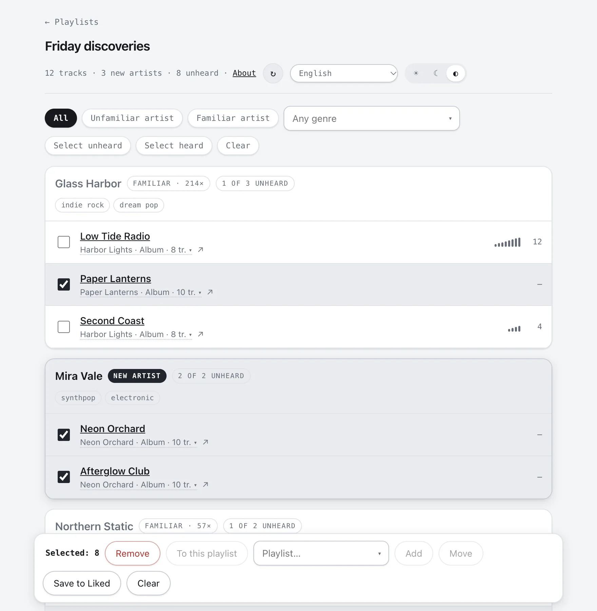

# Playlist Checker

Find what's new in any playlist. Playlist Checker reads a Spotify playlist, asks Last.fm
how often you have played each artist and track, and shows what you have already heard and
what is new to you — so you can keep the new tracks and clear out the rest.

**Use it at https://playlistchecker.com.** It runs entirely in your browser; the server
keeps nothing.



## What it does

- Groups a playlist's tracks by artist, with your Last.fm play count for each artist and
  track
- Filters by familiar or unfamiliar artist and by genre (Last.fm tags)
- Opens any album from the list, to see what you have heard from the rest of the release
- Adds, moves and removes tracks, saves them to Liked Songs, or copies the playlist
- Remembers Last.fm answers in your browser for a week, so a second look is instant
- Interface in 10 languages, light and dark theme

## What you need

- A **Last.fm account with a listening history**: the app only knows what you have
  scrobbled.
- **Spotify Premium**, to create your own Spotify developer app (free, about two minutes).
  Spotify allows each such app only five users, so everyone brings their own; the setup
  guide walks you through it.
- A **Last.fm API key** (free, instant).

Only playlists you own or collaborate on can be read. Spotify's own playlists (Release
Radar, Discover Weekly and the like) are closed to apps; copy their tracks into a playlist
of your own first. See [Spotify's limits](#spotify-api-limitations).

## Your data

Everything stays in the browser you use the app in:

|                              | Where                                              |
| ---------------------------- | -------------------------------------------------- |
| Spotify Client ID            | `localStorage`                                     |
| Last.fm username and API key | `localStorage`                                     |
| Spotify session              | `localStorage`                                     |
| Cached Last.fm answers       | IndexedDB, a week per record, per Last.fm username |
| Language and theme           | `localStorage`                                     |

The server relays Last.fm requests, because Last.fm does not allow browsers to call it
directly, and keeps nothing: no database, no logs, no analytics, no cookies. Spotify is
called straight from your browser. The [Privacy](https://playlistchecker.com/privacy) page
has the details.

**Sign out** on the playlist list ends the Spotify session and keeps your settings;
**Reset** erases everything this site stored in your browser.

## Setup

The first visit opens a start screen that explains the app; **Start** opens a three-step
guide. The guide opens at the first step whose value is missing or has failed its check,
so it is also where settings are corrected later — **Settings** on the playlist list leads
back to it.

1. **Your Spotify app.** Create one at https://developer.spotify.com/dashboard, tick only
   **Web API**, and set the Redirect URI to exactly the address the guide shows, trailing
   slash included. Use the guide's **Copy** button: typing it by hand, or dropping the
   slash, is the most common way this fails. If Spotify answers
   `INVALID_CLIENT: Invalid redirect URI`, that address is not registered in your app.
2. **Your Last.fm key.** Get one at https://www.last.fm/api/account/create (existing keys:
   https://www.last.fm/api/accounts). The guide checks it with a live request. If Last.fm
   stops accepting it later, the analysis stops and says so rather than reporting every
   artist as unheard.
3. **Sign in** with Spotify. Your own app authorises you; nobody has to add you anywhere.

### Keep a copy of your settings

**Safari clears what a site stores after about a week without a visit**, taking the
setup, the sign-in and the cache with it. **Save settings to a file** in the setup guide
and keep the file; **Load settings from a file** puts everything back except the sign-in,
which is one click. The Spotify session is deliberately not in the file: a file in a
downloads folder holding a long-lived key to your library is worse than signing in again.

The same file moves your setup to another browser or computer.

### The cache

Last.fm answers are kept for a week, reduced to what the screen shows: a play count and up
to four genre tags. A track or artist Last.fm does not know is kept for an hour only, since
a brand new track is unknown just until its first scrobble. **Re-check** on the analysis
screen runs a playlist again ignoring the cache; changing the Last.fm username or loading
a settings file empties it.

## Spotify API limitations

Since February 2026
([Spotify's announcement](https://developer.spotify.com/blog/2026-02-06-update-on-developer-access-and-platform-security)):

- A development-mode app needs Spotify Premium and allows five users, which is why each
  person uses their own app. Wider access is granted only to organisations with at least
  250k monthly active users.
- Playlist contents are returned only for playlists you own or collaborate on.
- Spotify's algorithmic and editorial playlists are not available at all. **Workaround:**
  in the Spotify app, select the tracks of, say, Release Radar, add them to a playlist of
  your own, and analyse that one.

## Languages

English, Español, Português (Brasil), Deutsch, Français, Italiano, Polski, Türkçe, 日本語
and Русский. The first visit follows the browser's language (exact locale first, then the
base language, e.g. `pt-PT` → `pt-BR`), falling back to English; the selector in the
header switches instantly and is remembered. Track, artist, album and playlist names, genre
tags and messages from Spotify are shown as received.

## Run your own copy

The site is a Cloudflare Worker with static files; you need a Cloudflare account and
Node.js 22 or later.

```bash
npm install
npx wrangler deploy
```

Before deploying, edit `wrangler.toml`:

- remove the `routes` (they name playlistchecker.com) or replace them with your own domain;
- set `PRIMARY_DOMAIN` to your domain, or remove it to use the address Cloudflare gives you;
- set `CONTACT_EMAIL` to your own address, or remove it;
- set `SOURCE_URL` to the repository of your copy: the AGPL-3.0 requires offering your
  users the source of the version you run, changes included.

The Privacy and Terms texts describe how playlistchecker.com is run; make sure they are
true for yours.

The page runs under a strict Content Security Policy: only its own files and two inline
snippets allowed by hash, and connections only to the site and Spotify. Keep the Cloudflare
features that rewrite pages or add scripts off for your domain: Rocket Loader, Zaraz,
automatic Web Analytics, and JavaScript Detections / Bot Fight Mode. With one of them on,
the browser blocks its scripts, and Rocket Loader also breaks the theme and the first paint.

### Contact, source and legal pages

Two settings under `[vars]` feed the footer and the Privacy and Terms pages:

- `CONTACT_EMAIL` — the operator's address. Left out when unset or not a valid address;
  the pages then point to the issue tracker instead.
- `SOURCE_URL` — the public repository (https), linked from the footer and the Terms.
  When unset, the footer has no source link and the Terms offer the source on request
  from `CONTACT_EMAIL`.

### Your own domain

The page carries its English start-screen text, a preferred address, link-preview tags and
picture, and the worker answers `/robots.txt` and `/sitemap.xml` (site root, Privacy and
Terms), all over https. Without `PRIMARY_DOMAIN` these are built from the domain the site
is requested at; on a local host they use the local address.

`PRIMARY_DOMAIN` (a bare host name such as `playlistchecker.com`) names the domain the
site lives at. Once it is set:

- every public address names it as the preferred address, and the robots file and sitemap
  point to it, whichever address the page was opened at;
- `www.` + that domain redirects permanently to the same path on it;
- on any other address (such as the `workers.dev` one), a first-time visitor is sent to the
  same page on the domain, and a visitor who already set the app up there keeps using it
  and sees how to move: save settings to a file, add the domain's Redirect URI to their
  Spotify app, load the file on the domain. Browser storage is per address, so nothing
  carries over by itself.

To attach a domain:

1. Add the domain to the Cloudflare account (buying it with Cloudflare Registrar does this).
2. In `wrangler.toml`, add the domain and its `www.` form as custom domains and keep
   `workers_dev = true` stated explicitly: with routes present and the setting missing, a
   deploy can turn the `workers.dev` address off and cut off everyone using it. Deploy.
3. Wait until both addresses answer over https, then set `PRIMARY_DOMAIN` and deploy again.
   Never set it before the domain answers: first-time visitors would be sent to a dead
   address. To try it on a preview, pass it for that upload only
   (`wrangler versions upload --var PRIMARY_DOMAIN:<domain>`).
4. Add `https://<domain>/` as a Redirect URI in your own Spotify app.
5. Register the domain in Google Search Console and submit `/sitemap.xml`.

The `workers.dev` address is deliberately not redirected: people using it would lose their
settings and sign-in.

## Development

```bash
npm install
npm run dev     # http://127.0.0.1:8787/
npm run check   # formatting, lint and tests
```

Nothing to configure: the setup guide asks for your Spotify Client ID and Last.fm key. To
sign in locally, register `http://127.0.0.1:8787/` as a Redirect URI in your Spotify app:
Spotify refuses `localhost` and accepts plain http only for a loopback IP address.

There is no build step. The layout:

- `src/worker/` — the worker: routing (`index.js`), the Last.fm relay, security headers,
  search-engine texts and the HTML shell of the page
- `public/app/` — the app: one browser module per area (Spotify sign-in, Last.fm and its
  cache, addresses, each screen, the action bar), the stylesheet and the interface texts;
  `main.js` starts it
- `public/img/` — screenshots and the link-preview picture
- `public/_headers` — headers for the static files; the app's code is revalidated on every
  load, so a page never runs with code from an older deployment
- `test/` — Node's built-in test runner

### Translations

The interface texts live in [`public/app/i18n.js`](public/app/i18n.js), shared by the
worker and the page. English is the reference dictionary and the fallback for any missing
key. Countable phrases are objects keyed by
[`Intl.PluralRules`](https://developer.mozilla.org/docs/Web/JavaScript/Reference/Global_Objects/Intl/PluralRules)
category (`one`, `few`, `many`, `other`); a missing category falls back to `other`.
Placeholders use `{name}`. Texts are inserted into HTML as-is, so they must not contain
double quotes or `<`.

To add a language, add `{ code, name }` to `LANGUAGES` and a dictionary with all English
keys to `DICTIONARIES`.

The Privacy and Terms texts are there too. When they change, update `LEGAL_UPDATED`, and
`LEGAL_PAGES` when a paragraph is added or removed; the English text is the one that
applies.

## Contributing

Bug reports and ideas are welcome as
[GitHub issues](https://github.com/xfuturomax/playlist-checker/issues). For a change larger
than a fix, open an issue first. `npm run check` must pass.

## License

[AGPL-3.0-or-later](LICENSE). Not affiliated with or endorsed by Spotify or Last.fm.
Play counts and genre tags are provided by [Last.fm](https://www.last.fm).
